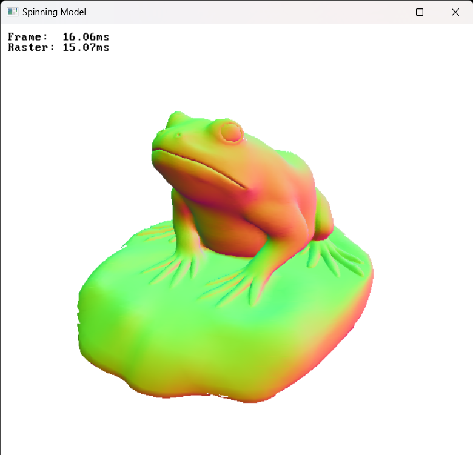

# Pocket
> :warning: *Work-in-progress!*

## Description
Pocket (or Pok) is a tiny graphics framework.

## Features
- 2D/3D software rasterizer
- Render triangles, lines and bitmap fonts
- Pixel shader and vertex attributes
- Manage windows and receive keyboard input
- Measure time with microsecond precision

**Note**: Angles are measured in radians.

## How to use
Just include the headers and compile the source files. If you use `pok_platform.c` you must also link against `gdi32`.

For example:
```
gcc my_program.c pok_core.c pok_math.c pok_util.c pok_gfx.c pok_io.c pok_platform.c -lgdi32 -o my_program
```

To compile the examples run:
```
cd examples
make all
```

## Screenshots

